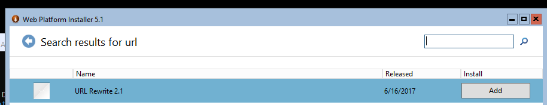
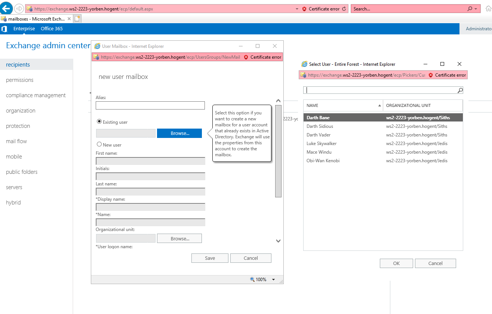
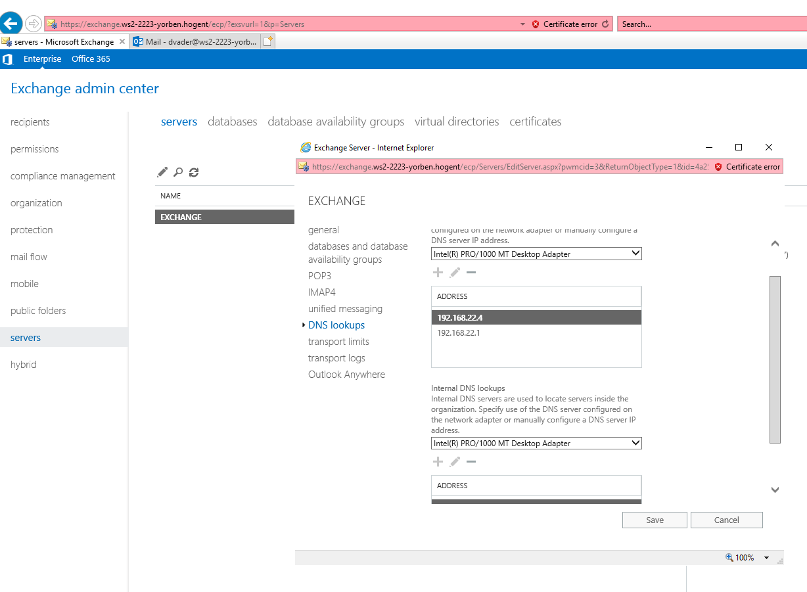
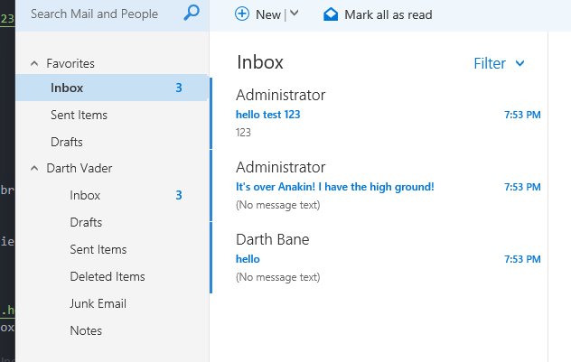

# Deployment Guide Windows Server II - Yorben Caplier

## Prerequisites

Om ervoor te zorgen dat alle vboxmanage-commando's werken, moet de install-directory van Virtualbox in de PATH-variabele gestoken in Windows. Hoe dit kan, kan je vinden op de volgende webpagina: https://www.roelpeters.be/vboxmanage-is-not-recognized-and-how-to-solve-it/

Na deze stappen uit te voeren zou het perfect mogelijk moeten zijn om alles uit te voeren.

Om al de nodige scripts naar de VM's te kopieren, voer het volgende commando uit:
```powershell
VboxManage guestcontrol $naamVM copyto --target-directory="C:\Users\Administrator\Desktop" "C:\Users\yorbe\Desktop\Windows Server II\scripts" --username Administrator --password 22Admin23
```
## Hoofdstuk 1: Aanmaken + Unattended Install Virtuele Machines

Om de VM's aan te maken in Virtualbox, voer je het volgende script uit in de `scripts`-directory: `WinServerVMAanmaken.ps1`. Dit zorgt ervoor dat de VM's in dezelfde groep worden aangemaakt in Virtualbox. Het is mogelijk om via de variabelen (bovenaan het script gedefinieerd) de paden voor de VDI's en nodige ISO's te veranderen.

Vervolgens zijn er twee manieren om de virtuele machines unattended te laten installeren: Alles in een keer, of elk apart. Afhankelijk van de sterkte van je PC kies je de gepaste optie. Al de VM's kunnen unattended geinstalleerd worden na de gepaste scripts uit te voeren in de `scripts\UnattendedInstall\`-directory.


## Hoofdstuk 2: Configuratie DC

Na al de unattended installs uit te voeren, voer je het `ADDSInstall.ps1`-script uit in de `DC`-directory. Bij het eerste keer uitvoeren van een script op de VM is het mogelijk dat je "a" moet tikken om de ExecutionPolicy te veranderen. Na het uitvoeren van het script moet je het Administrator paswoord invoeren (`22Admin23`).

Vervolgens, aangezien de DNS-role al geinstalleerd is bij het promoveren van de server naar Domain Controller, hoeft de DNS-rol enkel nog geconfigureerd te worden. Dit wordt gedaan met het `configDNS.ps1`-script.

Hierna vullen we de Active Directory op met gebruikers. Dit doen we aan de hand van het `configAD.ps1`-script.


Om NAT routering in te schakelen op deze server via de NAT-adapter, moet men het volgende doen:
- Ga vanuit je Server Manager naar Manage > Add Roles And Features > Role-based or Feature Installation
- Selecteer de DC-server.
- Installeer de Rol: Remote Access.
- Klik op "Next" tot je bij "Role Features" zit.
- Laat Windows Server al de nodige functies installeren.
- Nadat de installatie succesvol afgerond is, ga vanuit je Server Manager naar Tools > Routing and Remote Access.
- In het programma, right-click op je server (DC) en Klik op "Configure and Enable Routing and Remote Access".
- Klik op "Network address translation (NAT)".
- Selecteer de "Ethernet 2" netwerkadapter.
- Rond de installatiewizard af.


## Hoofdstuk 3: Configuratie DHCP/Secundaire DNS

Om de server toe te voegen aan het domein, en de nodige netwerkinstellingen te bewerken, voer je het `generalConfig.ps1`-script uit. 


Vervolgens, Om de DHCP rol te installeren, moet de server eerst manueel toegevoegd worden in Server Manager. Na dit te doen, voer je het script `installDHCP.ps1` uit.

Na het uitvoeren, zou er een scope aangemaakt moeten zijn met alle juiste opties. Vervolgens ga je naar Server Manager (op je DC) om daar de post-install configuratie-wizard te doorlopen. (Dit hoeft niet, is een bug op Windows Server)


## Hoofdstuk 4: Configuratie SQL Server/IIS

Om de server toe te voegen aan het domein, en de nodige netwerkinstellingen te bewerken, voer je het `generalConfig.ps1`-script uit. Hierna vervang je de Windows Server-ISO door de SQL-server ISO in Virtualbox. 
Dit kan gedaan worden door op je host het volgende commando uit te voeren:
```powershell
vboxmanage storageattach IIS --storagectl IDE --port 0 --device 0 --type dvddrive --medium "D:\VirtualBox VMs\en_sql_server_2019_standard_x64_dvd_814b57aa.iso"
```
Het pad kan vervangen worden door het gepaste pad op uw systeem.

Vervolgens run je op de VM (in een powershell window) het `InstallSQLServer.ps1` uit. Dit installeert SQL Server, en opent de nodige poorten voor communicatie binnen het domein.

Na het uitvoeren van het script, voeg je de server handmatig toe in Server Manager.

Hierna zou de Client connectie moeten kunnen maken met de SQL-server.

Vervolgens run je het `InstallIIS.ps1`-script op de server, waarna je via IIS manager connectie zou moeten kunnen maken met de server van op de DC.

Daarna run je het `SetupIIS.ps1`-script op de server.

LET OP: Voordat je het script runt, zet je IIS manager uit op je DC en voer het `powershell`-commando uit op je IIS-server. Windows geeft hier soms problemen mee, aangezien je bepaalde files aanpast die gelocked kunnen worden door IIS manager. Voor meer info, zie: https://stackoverflow.com/questions/44566284/cannot-commit-configuration-changes-because-the-file-has-changed-on-disk

## Hoofdstuk 5: Configuratie Exchange
Om de juiste IP-instellingen te verkrijgen en de server toe te voegen aan het domein, voert men het `generalConfig.ps1`-script uit. 
Om de Exchange ISO toe te voegen aan je server, voer het volgende commando uit op je host:
```powershell
vboxmanage storageattach Exchange --storagectl IDE --port 0 --device 0 --type dvddrive --medium "D:\VirtualBox VMs\mul_exchange_server_2019_cumulative_update_12_x64_dvd_52bf3153.iso"
```
Hierna voer je het `ExchangeInstall.ps1`-script uit. Tijdens dit script kunnen er verschillende venster verschijnen. Om de URL Rewrite-tool te installeren, moet je deze opzoeken in de installatiewizard (zie foto).



LET OP: Bij het uitvoeren van het `ExchangeInstall.ps1`-script moet je ingelogd zijn als Domain Admin (WS2-2223-yorben.hogent\Administrator). Daarnaast is het mogelijk dat je de server na de eerste keer runnen moet herstarten. Doe dit, en run vervolgens het script opnieuw.

Hierna zou Exchange succesvol geinstalleerd moeten zijn op je server!

Na het herstarten van de server voeg je deze handmatig doe via de Server Manager op de DC.

Om Exchange te configureren, ga je naar de volgende url: `https://exchange.ws2-2223-yorben.hogent/ecp/`.

Daar kan je inloggen met je gegevens:
```
Domain\User Name:
WS2-2223-yorben.hogent\Administrator
Password:
22Admin23
```

Doorloop het setup proces. Vervolgens kan je een mailbox aanmaken voor alle AD-gebruikers (zie screenshot).


Hierna moet je ook nog ervoor zorgen dat de juiste DNS-servers gebruikt worden (zie screenshot).



Ga naar de volgende link om mails te versturen: `https://exchange.ws2-2223-yorben.hogent/owa/`
Vanaf nu is het mogelijk om mails naar AD-users te versturen (indien ze een mailbox hebben).



LET OP: Indien de mails niet volledig doorkomen, is het mogelijk dat sommige Exchange-services gestopt zijn. Hiervoor ga je naar Server Manager (op de DC) > Dashboard > All Servers > Services. Dan selecteer je al de services, right-click, en druk je op 'Start Services'.

Je kan de exchange-server ook toevoegen in IIS Manager op de DC. Dit doe je door naar `Connections` > `Connect to Server...` te gaan en daar de juiste gegevens in te vullen (servernaam: `exchange.ws2-2223-yorben.hogent`, Gebruikersnaam: `ws2-2223-yorben.hogent\Administrator`, Paswoord: `22Admin23`). Vervolgens wordt er gevraagd om bepaalde software te installeren, doe dit. De server zou moeten toegevoegd worden aan IIS Manager. 
## Hoofdstuk 6: Configuratie Client

Na het unattended installeren van de client, voer je eerst het volgende commando uit in een Adminitrator Powershell CLI: ```Set-ExecutionPolicy -ExecutionPolicy RemoteSigned```. Daarna voer je het `ClientConfig.ps1`-script uit. Dit installeert de nodige software en voegt de client toe aan het domein.