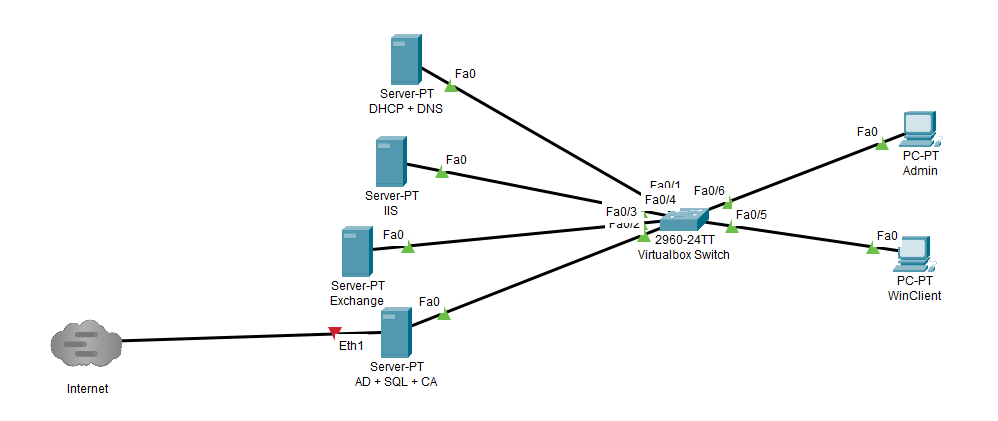
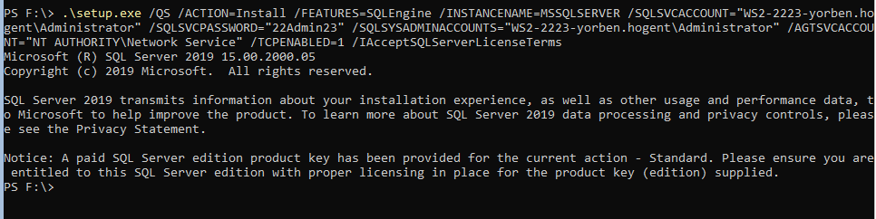

# Portfolio Windows Server II - Yorben Caplier

Voor deze opdracht heb ik besloten mijn VM's als volgt op te stellen:

## Opstelling/Configuratie Virtuele Machines
|DCHP + DNS| IIS + SQL| Exchange  | AD (Domeincontroller) + CA + Routing/NAT + Primaire DNS|
|---|---|---|---|
|IP-adres: 192.168.22.1   |IP-adres: 192.168.22.2   |IP-adres: 192.168.22.3   |IP-adres: 192.168.22.4 (intern netwerk) + 10.0.2.15 (NAT)  |
|vCPUs: 2   | vCPUs: 2  | vCPUs: 4  | vCPUs: 2  |  
| vRAM: 1GB  | vRAM: 1GB  | vRAM: 8GB  | vRAM: 3GB  |
| Netwerkadapter: INTNET  | Netwerkadapter: INTNET  | Netwerkadapter: INTNET  | Netwerkadapter: NAT + INTNET   |
|FQDN: dhcpdns.ws2-2223-yorben.hogent |FQDN: iis.ws2-2223-yorben.hogent |FQDN: exchange.ws2-2223-yorben.hogent |FQDN: dc.ws2-2223-yorben.hogent |

De AD + CA + Routing + primaire DNS-server zal dienen als domeincontroller. Deze wordt dus bijgevolgd aangemaakt met een GUI. De rest van de server zullen zonder GUI (Desktop Experience).

Er is 1 Windows Client binnen het domein, met 2GB RAM, 1 vCPU, en 35GB opslagruimte (dynamisch gealloceerd).
### Naam van het domein: WS2-2223-yorben.hogent

## DCHP + DNS

### FQDN/Hostname: dhcpdns.ws2-2223-yorben.hogent
Deze server zal enkel een command-line interface hebben. Deze beschikt over 2 vCPUs en 1GB vRAM. Deze VM heeft alleen een INTNET-interface. De virtuele schijf hiervan zal 30gb groot zijn, maar dynamisch gealloceerd, zodat het niet teveel ruimte opneemt op mijn host. Ik heb deze twee netwerkdiensten samengenomen aangezien deze allebei relatief "lightweight" zijn om te draaien. De DNS-rol op deze server zal dienen als secundaire DNS. De DHCP zal Ip-adressen uitgeven aan de clients, binnen volgende range: **192.168.22.101-150** met als subnetmask **255.255.255.0** . Het volledige domeinnaam van de server is `dhcpdns.ws2-2223-yorben.hogent`. 
## IIS + SQL
### FQDN/Hostname: iis.ws2-2223-yorben.hogent
Deze server zal enkel beschikken over een command-line interface. Deze heeft twee virtuele CPUs en 1GB vRAM. Deze VM heeft alleen een INTNET-interface. De virtuele schijf hiervan zal 20gb groot zijn, maar dynamisch gealloceerd, zodat het niet teveel ruimte opneemt op mijn host. Deze server zal een website hosten op volgende URL: `https://www.ws2-yorben.hogent`. Deze site zal ook voorzien zijn van een certificaat, uitgegeven door de CA.
## Exchange
### FQDN/Hostname: exchange.ws2-2223-yorben.hogent
Deze server zal enkel een command-line interface hebben. Deze VM heeft 4 vCPUs en 8gb vRAM. Op deze VM zal Windows Server 2019 gezet worden, evenals een Exchange Server ISO. De virtuele schijf hiervan zal 40gb groot zijn, maar dynamisch gealloceerd, zodat het niet teveel ruimte opneemt op mijn host. Het volledige domeinnaam van deze server zal `exchange.ws2-2223-yorben.hogent` zijn.

## AD + SQL + CA + Routing/NAT (Domeincontroller)
### FQDN/Hostname: dc.ws2-2223-yorben.hogent
De domeincontroller zal beschikken over 2vCPUs, en 3gb vRAM. Hierop staan de Active Directory-services, een SQL-server, en een Certificate Authority. De virtuele schijf hiervan zal 40gb groot zijn, maar dynamisch gealloceerd, zodat het niet teveel ruimte opneemt op mijn host. Ik heb gekozen om AD en SQL samen te nemen, aangezien deze gelinkt moeten worden aan elkaar. De ingebouwde DNS-rol op deze server zal dienen als primaire DNS. Deze zal zijn forwarders instellen op die van Google. Het volledige domeinnaam van de server is `dc.ws2-2223-yorben.hogent`.

## Clients

Er zijn twee clients die opgezet zullen worden, 1 client (admin) met de nodige administratietools om de servers zonder GUI te beheren, en 1 client die een gewone gebruiker voorstelt. Beide clients krijgen een IP-adres van de DHCP-server binnen volgende range: **192.168.22.101-150** met als subnetmask **255.255.255.0** . Ze zullen beschikken over 1 vCPU en 2 gb vRAM. Ze hebben ook een virtuele harde schijf van 45gb, die dynamisch gealloceerd is.

Om te kunnen testen als de client aan de SQL-server kan, wordt `SQL Management Studio` geinstalleerd op de client.
Daarnaast wordt de Windows Mail-Client gebruikt om mails te ontvangen en verzenden.

## Opzetten en Configuratie

## 1. DHCP + DNS
Bij het opzetten van deze server ging ik via het `sconfig`-commando naar het serverconfiguratiescherm, waar ik de IP-instellingen aanpaste waar nodig. Nadat ik de server toegevoegd heb aan het domein via de juiste credentials, voegde ik via de Server Manager op mijn domeincontroller de rollen `DHCP Server` en `DNS Server` toe. Ik installeerde ook de features `DHCP Server Tools` en `DNS Server Tools` op zowel de DHCP + DNS-server als op de domeincontroller.

Ik liet niet toe dat de server geauthenticeerd moest worden door AD DS. Vervolgens liet ik de DHCP + DNS server herstarten om de security groups aan te brengen binnen het domein. 

Vervolgens maakte ik via de Server Management Tools op mijn domeincontroller een DHCP Scope aan voor de clients.

Om ervoor te zorgen dat deze server ook ingesteld werd als een secundaire DNS-server, heb ik via de DNS Manager op de domeincontroller de DHCP/DNS-server geconnecteerd, en vervolgens via de wizard een secundaire forward- en reverse lookup-zone aangemaakt. Vervolgens had ik een probleem: de transfer tussen de zones was mislukt. Hiervoor moest ik in de "properties" van de primaire DNS-server "zone transfers" toelaten. Dit voor zowel de forward- als de reverse lookup-zone. Wegens security-gerelateerde redenen heb ik een lijst aangemaakt met de toegestane servers.

## 2. IIS + SQL
Om de IIS-server toe te voegen aan het domein, moest ik eerst de nodige IP-instellingen veranderen. Ik gaf deze server het IP-adres `192.168.22.2/24`, met als default gateway `192.168.22.4`(IP-adres van de domeincontroller), en `192.168.22.4` en `192.168.22.1` als DNS-servers.

Vervolgens voegde ik via de sconfig-utility de server toe aan het domein. Op de domeincontroller voegde ik via de Server Manager de IIS-server toe aan het Server Manager-overzicht. Via de `Add Roles & Features`-functionaliteit installeerde ik de nodige IIS-tools. 
Wanneer ik IIS Manager wilde verbinden met de IIS-server, mislukte dit (zie screenshot).

Na het raadplegen van deze site: https://www.stephenwagner.com/2019/05/14/manage-remotely-iis-on-windows-server-2019-server-core/ bleek dat er een firewall-regel ingesteld moest worden om deze communicatie toe te staan, evenals het feit dat de Web Management Service nog geinstalleerd moest worden op de IIS-server. Na dit probleem op te lossen, bleek dat de IIS-server geen remote connecties toeliet (zie foto). Ik heb dit probleem opgelost door de IIS Management Tools te installeren op de IIS-server.

Om ervoor te zorgen dat `www.ws2-2223-yorben.hogent' bereikbaar wordt, moesten de juiste DNS-records opgesteld worden. Ik heb een CNAME-record (alias) aangemaakt op de DNS-server hiervoor. Daarnaast heb ik ook een statische HTML-pagina aangemaakt op de IIS-server zelf, waarna ik deze directory gebind heb aan het HTTPS-protocol en poort 443.

Uiteindelijk heb ik besloten om SQL server ook nog op deze server te zetten, aangezien het niet veilig is om SQL Server op een Domeincontroller te zetten. Na het toevoegen van de ISO, doorliep ik het installatieproces door de `setup.exe`-file te runnen met de nodige parameters. Daarna opende zich de installatiewizard. Nadat de juiste product key al ingevoerd werd door Academic Software, installeerde SQL Server zich.

Na het installeren van SQL-server, moest ik ook de juiste firewall-regels instellen, zodat het verkeer doorgelaten werd naar de SQL-server, vanop de client. Deze commando's zijn verwerkt in het `InstallSQLServer.ps1`-script.

Hierbij had ik eerst een probleem: de client kon niet connecteren met de server. Uiteindelijk, na het runnen van het `setup.exe /Action=RunDiscovery`-commando (in de juiste drive), werkte de connectie, zoals aangetoond op de screenshot.

## 3. Exchange

Om deze server als Exchange-server te gebruiken, moest ik de server een gepast IP-adres geven (in dit geval `192.168.22.3`). Daarnaast gaf ik het ook de gepaste DNS-servers gegeven (`192.168.22.4` als primaire DNS en `192.168.22.1` als secundaire DNS).

## 4. AD + CA + Routing/NAT(Domeincontroller)

Om de domeincontroller in te stellen maken we gebruik van de GUI. Bij het installeren van de AD DS (Active Directory Domain Services) stellen we de NetBIOS-naam in als volgt: `WS2-2223-YORBEN`. Deze server wordt ook gebruikt als primaire DNS. Na het installeren van de rol, en de server te promoveren naar Domein Controller, moet de eerste netwerkadapter een statisch IP-adres krijgen. Deze configuratie gebeurt door het script uit te voeren. Om de functionaliteiten op andere servers te kunnen beheren van op de domeincontroller, installeer ik de nodige Server Management Tools.

Bij het instellen van de primaire dns heb ik de forwarders ingesteld op die van Google (8.8.8.8) en Quad9 (9.9.9.9).

Vervolgens heb ik NAT routering ingesteld op de domeincontroller. Ik doorliep het installatieproces, en vinkte bij "Role Services" het "Routing"-vakje aan. 

Ik heb ook besloten om de Certificate Authority op deze server te zetten. Hiernaast heb ik ook de Certificate Authority Web Enrollment-feature geinstalleerd.

## 5. Client

Om de client aan te maken, moet men het script `/Scripts/WinServerVMAanmaken.ps1` uitvoeren. Vervolgens, om de client aan het domein toe te laten voegen en de juiste IP-instellingen te verkrijgen, voert men het `/Scripts/Clients/ClientConfig.ps1`-script uit. Na het toevoegen van de pc aan het domein, kan men inloggen met alle gebruikers in de Active Directory. Daarnaast krijgt het ook een lease van de DHCP-server. 

Om te kunnen testen als de client aan de SQL-server kan, wordt `SQL Management Studio` geinstalleerd op de client.
Daarnaast wordt de Windows Mail-Client gebruikt om mails te ontvangen en verzenden.

Ingelogde AD-gebruiker op client:

De DHCP-lease van de client:

Een overzicht van de IP-instellingen van de client:

De Client heeft ook via de NAT/Routing rol op de domeincontroller toegang tot het internet.

 